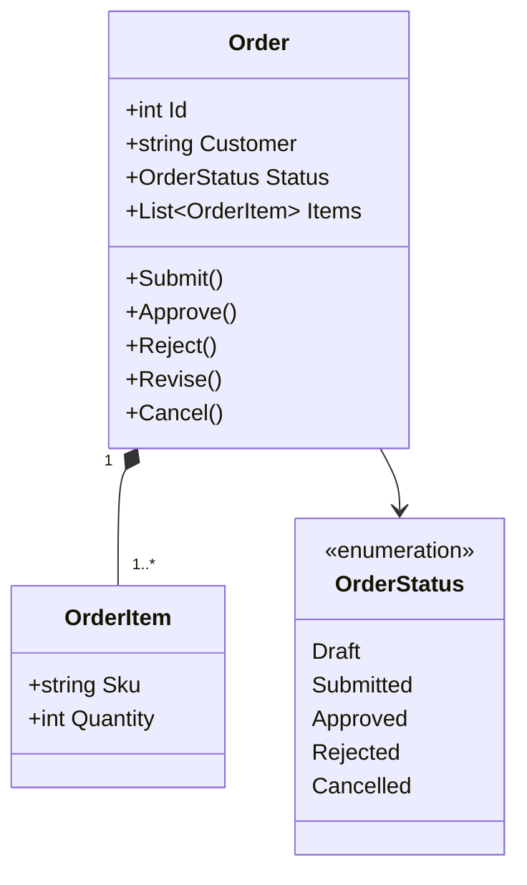
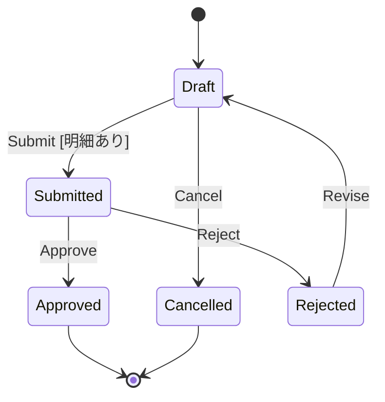

# 注文ドメイン 詳細設計

## 構造

```mermaid id=class
classDiagram
  class Order {
    +int Id
    +string Customer
    +OrderStatus Status
    +List~OrderItem~ Items
    +Submit()
    +Approve()
    +Reject()
    +Revise()
    +Cancel()
  }
  class OrderItem {
    +string Sku
    +int Quantity
  }
  class OrderStatus {
    <<enumeration>>
    Draft
    Submitted
    Approved
    Rejected
    Cancelled
  }
  Order "1" *-- "1..*" OrderItem
  Order --> OrderStatus
```

## 状態

参照：:ref[../basic/order.md#注文確定の処理]

```mermaid id=order-status code=STATUS matrix nswitch=0
stateDiagram-v2
  [*] --> Draft
  Draft --> Submitted : Submit [明細あり]
  Draft --> Cancelled : Cancel
  Submitted --> Approved : Approve
  Submitted --> Rejected : Reject
  Rejected --> Draft : Revise
  Approved --> [*]
  Cancelled --> [*]
```

- 不正遷移（表で × のセル）は `InvalidOperationException` を送出する
